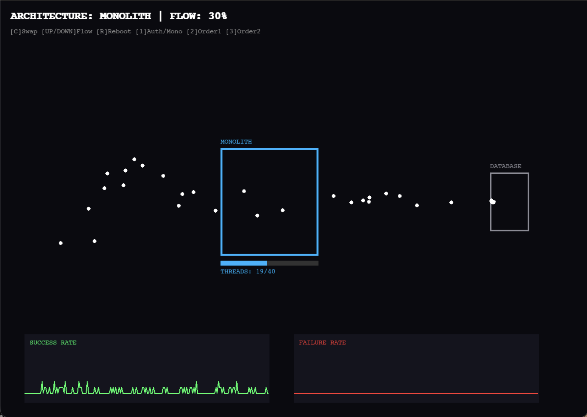
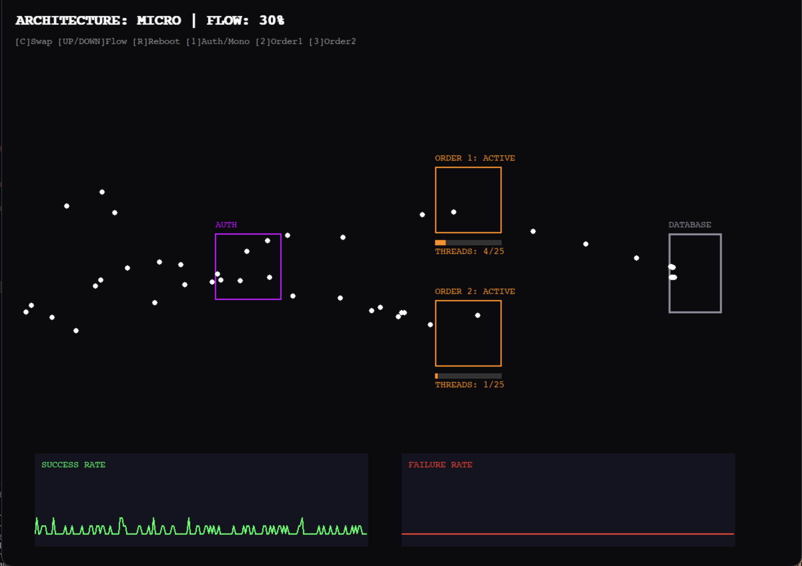

# Monolithic vs. Microservices Architecture: A Resilience Simulation

## 1. Project Overview
This project simulates the behavior of two distinct software architectures—Monolithic and Microservices—under high-load stress tests. Built using Pygame, the simulation visualizes how requests flow through a system and demonstrates critical concepts like Thread Exhaustion, Fate Sharing, Bulkheading, and Cascading Failures.

The goal is to empirically model why Monolithic applications are prone to total system "crushes" (blackouts) under load, whereas Microservices can exhibit partial survivability through resource isolation.

## 2. Research-Backed Mechanics
This model does not use naive assumptions; it is built upon specific architectural patterns defined in industry research.

### 2.1 External Resource: "The Tail at Scale" (Dean & Barroso, Google Research)
- Tail Latency & Queueing. The paper demonstrates that shared resource bottlenecks (like a single database) cause exponential queuing delays.
- Implementation in Code: 
        The `DB_CAPACITY = 35` constant models the saturation point defined in the paper.
        When the Database queue exceeds this limit, processing time for all requests increases, creating a "backlog" that simulates real-world tail latency.
## 2.2 External Resource 2: "Release It! Design and Deploy Production-Ready Software" (Michael Nygard)
Bulkheads & Fate Sharing. Nygard defines "Fate Sharing" as a monolith failing entirely because one component hangs. "Bulkheading" is the microservice pattern of isolating thread pools so a failure in one area does not kill the whole system.
- Implementation in Code 
    - Monolith Mode: Uses a single global `MONO_LIMIT = 40`. If 40 requests stack up (waiting for the DB), the entire server crashes (turns Gray). This models "Fate Sharing."
    

    - Microservice Mode: Uses isolated pools (`SVC_LIMIT = 25`). If "Order Service 1" crashes, "Order Service 2" and "Auth Service" remain active. This models "Bulkheads."
    